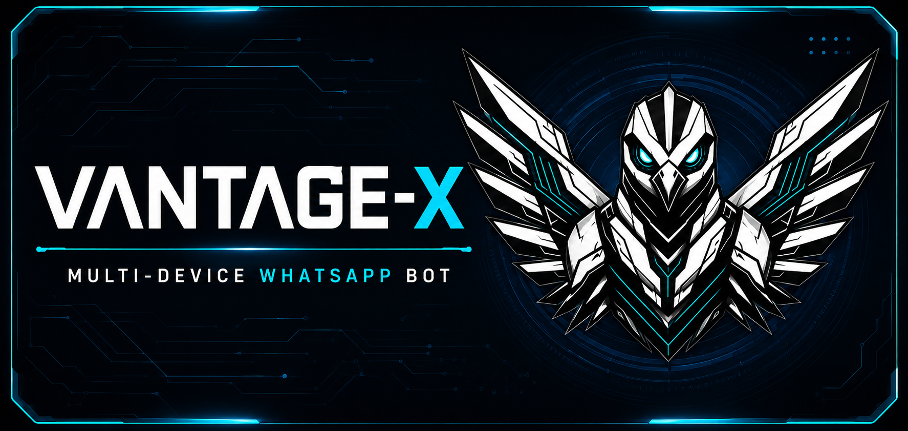

<div align="center">



# VANTAGE-X MD

**Fast. Smart. Yours.**

[](https://github.com/N0rd-X/VANTAGE_X-MD/releases)
[](LICENSE)
[](https://nodejs.org)
[](https://github.com/N0rd-X/VANTAGE_X-MD/stargazers)

</div>

---

## Quick Start

**1. Fork this repository**

<div align="center">
<a href="https://github.com/N0rd-X/VANTAGE_X-MD/fork">
  
</a>
</div>

**2. Get a Session ID** — pair your WhatsApp at the link below. The Session ID arrives via WhatsApp message, never through the browser.

<div align="center">
  <a href="https://vantagex-pairing.onrender.com/">
    
  </a>
</div>

**3. Configure and run**

```bash
git clone https://github.com/N0rd-X/VANTAGE_X-MD.git
cd Vantage_X-MD
npm install
cp .env.example .env   # set SESSION_ID and OWNER_NUMBER
npm start
```

Full setup instructions → [INSTALL.md](INSTALL.md)

---

## Deploy

<div align="center">

| Platform | Link |
|---|---|
| Railway | [](https://railway.app/new/template?template=https://github.com/N0rd-X/VANTAGE_X-MD) |
| Render | [](https://dashboard.render.com/select-repo?type=web) |
| Koyeb | [](https://app.koyeb.com/services/deploy?type=git&repository=N0rd-X/VANTAGE_X-MD) |
| Heroku | [](https://dashboard.heroku.com/new?template=https://github.com/N0rd-X/VANTAGE_X-MD) |

</div>

Platform-specific instructions → [DEPLOYMENT.md](DEPLOYMENT.md)
Keeping the bot alive on free hosting → [KEEPALIVE.md](KEEPALIVE.md)

---

## Features

| Feature | Status |
|---|---|
| Multi-platform downloader (YouTube, TikTok, Instagram, X, Facebook) | Active |
| Group management (promote, kick, antilink, warn, welcome) | Active |
| Interactive games and economy system | Active |
| Auto sticker creation | Active |
| Efficiency mode — concurrency cap for heavy commands | Active |
| Anti-delete, anti-spam, anti-NSFW safeguards | Partial |
| AI commands | In development |

Full command reference → [COMMANDS.md](COMMANDS.md)

---

## Community

<div align="center">

[](https://whatsapp.com/channel/0029VbE0dNM0rGiHzZ5KEY2i)
[](https://chat.whatsapp.com/PLACEHOLDER)

</div>

---

## Documentation

| File | Contents |
|---|---|
| [INSTALL.md](INSTALL.md) | Setup guide for all platforms |
| [DEPLOYMENT.md](DEPLOYMENT.md) | Platform-by-platform deploy guide |
| [KEEPALIVE.md](KEEPALIVE.md) | Preventing idle shutdown on free hosting |
| [COMMANDS.md](COMMANDS.md) | Command reference and category taxonomy |
| [CONTRIBUTING.md](CONTRIBUTING.md) | How to contribute |
| [SECURITY.md](SECURITY.md) | Responsible disclosure and session safety |
| [CHANGELOG.md](CHANGELOG.md) | Version history |

---

## Acknowledgments

- [WhiskeySockets/Baileys](https://github.com/WhiskeySockets/Baileys) — The WhatsApp library this project is built on
- Nord-X — Development and maintenance
- [Madara X-MD Inc.](https://youtube.com/@madaradevxinc)— Promotion, media, and tutorials
- Community — Every star, fork, and contribution ❤️

---

## License

MIT — free to use, modify, and distribute. See [LICENSE](LICENSE).

## Disclaimer

VANTAGE-X MD is an independent, community-built project. It is **not affiliated with, endorsed by, or associated with Meta Platforms, Inc. or WhatsApp LLC** in any way. WhatsApp is a trademark of Meta Platforms, Inc. Use of this software is at your own risk and responsibility.

---

<div align="center">

Made by [Nord-X](https://github.com/N0rd-X) · [Star this repo](https://github.com/N0rd-X/VANTAGE_X-MD/stargazers) if you like the bot

</div>

